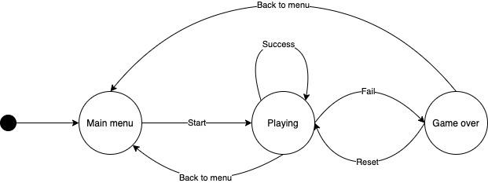

# Game state machine
Let's assume state machine for a game. When we start the game app, we find ourselves in the **main menu**. Let's say our game is very simple and we have only two options in menu: 
1. Start playing
2. Exit game app

If we choose to have a fun and play game, we go to the **playing** state. Often when we play some game, we can complete some level or die trying. In case we are successful, we can continue playing on the next level. Second option is to leave game as undefeated hero. Nad finally we can lose and the game is over - we are in **game over** state.
As in main manu, also in game over state we have to option:
1. We can accept the failure and leave the game back to the main menu
2. Try again by reseting game and starting from the beggining.

This is state machine for ordinary gameplay with three state and several transition between them. See the image below.

# State Machine Compiler
SMC generates finite state machines for objects - not processes or applications but for an individual object. If you have objects that receive asynchronous callbacks and how objects respond to those callbacks are based on the object state, then SMC provides a powerful solution.
Thanks to the State Machine Compiler, you can put state diagram into one file written in a simple language and generate class for a wide range of programming languages.

# Features
## Transitions
Simple Transiiton
External Loopback Transition
Internal Loopback Transition
Push Transition
Pop Transition
## Transition Actions
## Entry / Exit Actions
## transition guards

# Compiling .sm file

# License
GNU GENERAL PUBLIC LICENSE